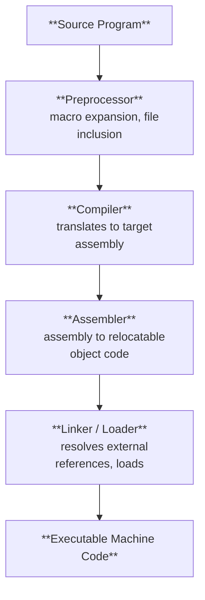
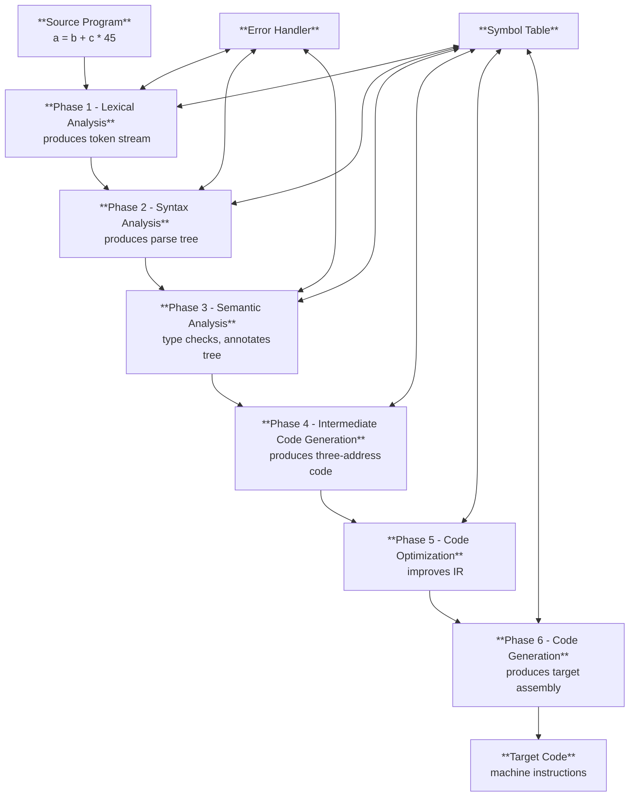
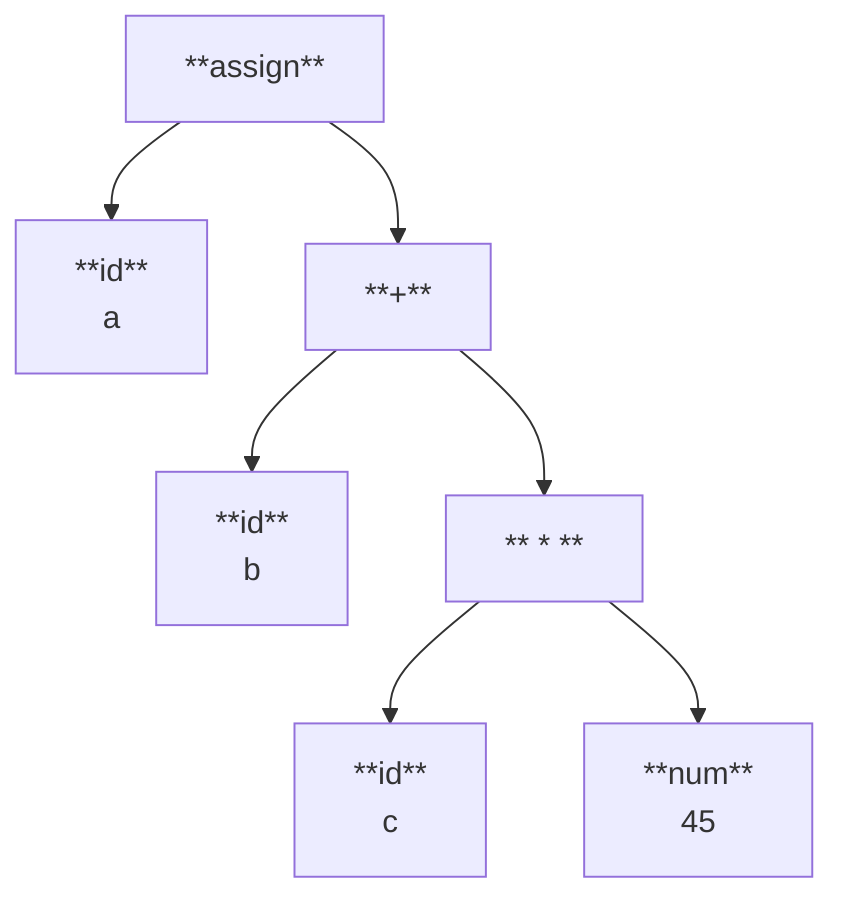
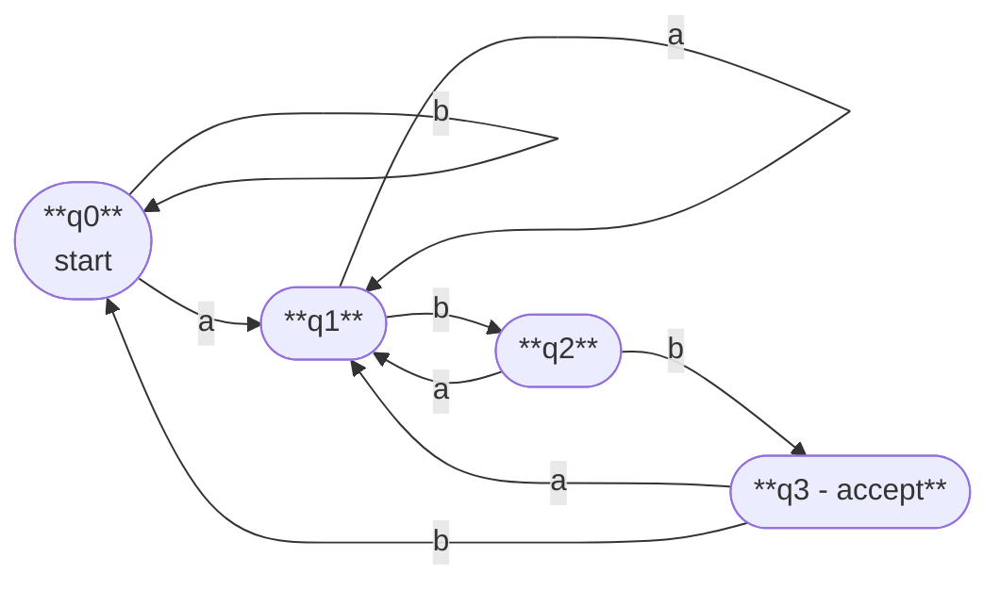
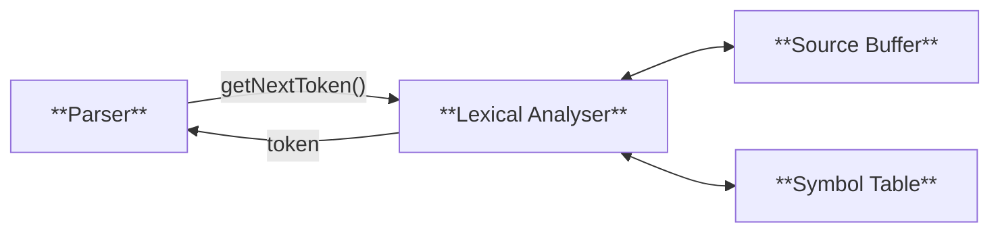
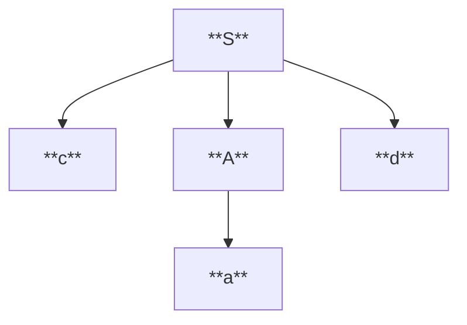

### Part-A

#### 1. Identify the significance of a compiler with an example.

A compiler translates a high-level source language into a lower-level target language (usually machine code) before execution. The entire source program is translated at once, and the resulting object code can be executed repeatedly without re-translation.

**Example:** GCC compiles a C source file `hello.c` into a native executable binary. The developer writes readable C; the compiler produces CPU-specific machine instructions. The programmer never interacts with the target code directly.

---

#### 2. Define tokens, patterns and lexemes.

|Term|Definition|Example|
|---|---|---|
|**Token**|A category representing a class of lexical units|`id`, `num`, `relop`|
|**Pattern**|A rule (usually a regex) describing all strings that belong to a token|`letter (letter \| digit)*` for `id`|
|**Lexeme**|The actual character sequence in source code that matches a pattern|`count`, `total`, `x1`|

---

#### 3. Differentiate bottom-up and top-down parsers with an example.

|Feature|Top-Down|Bottom-Up|
|---|---|---|
|Build direction|Root to leaves|Leaves to root|
|Strategy|Predict then match|Shift then reduce|
|Typical methods|Recursive descent, LL(1)|SLR, CLR, LALR|
|Grammar class|LL grammars|LR grammars (more powerful)|
|Left recursion|Cannot handle directly|Handles naturally|

**Example:** For `id+id`, top-down predicts `E -> T + E` and tries to match; bottom-up shifts `id`, reduces to `T`, shifts `+`, and so on.

---

#### 4. Compute regular definition for an identifier.

$$\text{letter}_ \rightarrow [a\text{-}zA\text{-}Z_]$$ $$\text{digit} \rightarrow [0\text{-}9]$$ $$\text{identifier} \rightarrow \text{letter}_ ; (\text{letter}_ \mid \text{digit})^*$$

An identifier starts with a letter or underscore, followed by zero or more letters, digits, or underscores.

---

#### 5. Differentiate LR, CLR and LALR with a suitable example.

| Feature          | SLR (LR)                 | CLR (LR(1))                | LALR                         |
| ---------------- | ------------------------ | -------------------------- | ---------------------------- |
| Lookahead source | FOLLOW sets              | Exact LR(1) lookaheads     | Merged LR(1) lookaheads      |
| Power            | Least                    | Most                       | Between SLR and CLR          |
| Table size       | Smallest                 | Largest                    | Same number of states as SLR |
| Basis            | LR(0) items              | LR(1) items                | Merged LR(1) items           |
| Conflicts        | More potential conflicts | Fewest conflicts           | Rare spurious conflicts      |
| Tool usage       | Educational              | Rarely used (large tables) | Yacc/Bison                   |

---

#### 6. Build a grammar by eliminating left recursion: `S->S*C|C; C->Cb|F; F->id`

For `S -> S*C | C` (α = `*C`, β = `C`): $$S \rightarrow CS'$$ $$S' \rightarrow *CS' \mid \varepsilon$$

For `C -> Cb | F` (α = `b`, β = `F`): $$C \rightarrow FC'$$ $$C' \rightarrow bC' \mid \varepsilon$$

`F -> id` has no left recursion - unchanged.

---

#### 7. Discuss handle pruning with an example.

A **handle** is a substring of a right-sentential form that matches the RHS of some production, whose reduction represents one step of a rightmost derivation in reverse.

**Handle pruning** repeatedly identifies and reduces handles until the start symbol is reached.

**Example:** Grammar: `E -> E+T | T`, `T -> id`. Input: `id + id`

|Sentential Form|Handle|Reduced To|
|---|---|---|
|`id + id`|`id` (first)|`T`|
|`T + id`|`T`|`E`|
|`E + id`|`id` (second)|`T`|
|`E + T`|`E + T`|`E`|
|`E`|-|Accept|

---

#### 8. Differentiate NFA and DFA.

|Feature|NFA|DFA|
|---|---|---|
|Transitions per state|Multiple (or 0) per symbol|Exactly one per symbol|
|ε-moves|Allowed|Not allowed|
|Acceptance condition|Any accepting path|Unique deterministic path|
|State count|Usually fewer|Can be exponentially more|
|Simulation|Needs subset tracking|Simple table lookup|
|Language recognition|Equivalent to DFA|Equivalent to NFA|

---

#### 9. Depict the schematic diagram for a language processing system.



---

#### 10. Define the term coercion.

**Coercion** is an implicit (automatic) type conversion performed by the compiler when an operation involves operands of different but compatible types. The programmer does not write an explicit cast.

**Example:** `float f = 2.5; int i = 5; float r = i + f;` - the compiler automatically converts `i` from `int` to `float` before the addition. This is coercion, unlike an explicit cast `(float)i`.

---

#### 11. Differentiate compiler and interpreter.

|Feature|Compiler|Interpreter|
|---|---|---|
|Translation|Entire source at once|Statement by statement|
|Output|Executable object code|No separate object code produced|
|Execution speed|Faster (pre-compiled)|Slower (translates at runtime)|
|Error detection|After full compilation|Stops at first encountered error|
|Memory|More (stores object code)|Less|
|Examples|GCC (C), javac (Java)|Python, Ruby, Bash|

---

#### 12. Define ambiguous grammar with an example.

A grammar is **ambiguous** if there exists at least one string in the language that has two or more distinct parse trees (equivalently, two or more leftmost or rightmost derivations).

**Example:**

```
E -> E + E | E * E | id
```

The string `id + id * id` yields two parse trees - one where `+` is the root (wrong precedence) and one where `*` is the root (correct precedence) - making this grammar ambiguous.

---

#### 13. Eliminate the left recursion for the grammar: `A -> Ac | Aad | bd | c`

Left-recursive alternatives: `Ac`, `Aad` (α₁ = `c`, α₂ = `ad`) Non-left-recursive alternatives: `bd`, `c` (β₁ = `bd`, β₂ = `c`)

$$A \rightarrow bdA' \mid cA'$$ $$A' \rightarrow cA' \mid adA' \mid \varepsilon$$

---

#### 14. What is the need for type checking?

- Detects type mismatches at compile time (e.g., assigning a string to an integer)
- Ensures operations are applied only to compatible operands
- Prevents runtime type errors and unexpected crashes
- Supports strong type safety guarantees required by the language specification

---

#### 15. Mention the role of semantic analysis.

- Checks semantic correctness beyond syntactic structure
- Performs type checking for expressions, assignments, and function calls
- Verifies variable declarations and scope resolution
- Checks function call argument counts and types match declarations
- Annotates the parse tree with type information for use in later phases

---

#### 16. Illustrate error handling and recovery in a syntax analyser.

|Strategy|Description|
|---|---|
|**Panic mode**|Discard input tokens until a synchronizing token (`;`, `}`) is found; simplest method|
|**Phrase-level recovery**|Locally correct the remaining input by inserting, deleting, or replacing a token|
|**Error productions**|Add common erroneous constructs explicitly to the grammar|
|**Global correction**|Find minimum edits to make input valid; theoretically optimal but expensive|

Most practical parsers use panic mode due to its simplicity and predictable behavior.

---

#### 17. Define sentinel and input buffering.

**Input buffering:** Uses two fixed-size buffers (typically 4 KB each) loaded alternately. Two pointers - `lexemeBegin` (start of current lexeme) and `forward` (scanning ahead) - track position. This avoids one OS read call per character.

**Sentinel:** A special character (typically `eof`) placed at the end of each buffer half. It eliminates an explicit buffer-boundary check on every character advance, reducing the overhead of the inner scanning loop to a single `eof` test.

---

#### 18. Mention the role of syntax analysis.

- Receives the token stream from the lexical analyser
- Verifies that the token sequence conforms to the grammar of the language
- Builds a parse tree or abstract syntax tree (AST) representing syntactic structure
- Reports syntax errors with location information for the programmer

---

#### 19. Mention the role of lexical analysis.

- Reads the source program character by character
- Groups characters into lexemes and returns corresponding tokens to the parser
- Strips whitespace and comments from the source
- Handles input buffering for efficient I/O
- Inserts identifiers into the symbol table

---

#### 20. Define Context Free Grammar.

A **Context Free Grammar (CFG)** is a 4-tuple $G = (V, T, P, S)$ where:

- $V$ = finite set of non-terminal symbols
- $T$ = finite set of terminal symbols, $V \cap T = \emptyset$
- $P$ = finite set of productions of the form $A \rightarrow \alpha$, where $A \in V$, $\alpha \in (V \cup T)^*$
- $S \in V$ is the start symbol

---

#### 21. Mention the compiler construction tools.

- **Lex / Flex** - lexical analyser generator
- **Yacc / Bison** - LALR parser generator
- **ANTLR** - LL(*) parser generator supporting multiple target languages
- **LLVM** - compiler infrastructure and backend code generation framework

---

#### 22. Define Thompson's rule.

Thompson's construction rules convert a regular expression systematically into an NFA:

|Regex|NFA rule|
|---|---|
|$\varepsilon$|Single ε-transition from start to accept|
|symbol `a`|Single `a`-transition from start to accept|
|`r \| s`|New start/accept with ε-transitions into and out of r-NFA and s-NFA|
|`rs`|Accept state of r-NFA becomes start state of s-NFA via ε-transition|
|`r*`|New start/accept; ε to r-NFA start; r-NFA accept loops back via ε; ε to new accept|

---

#### 23. Define recursive descent parsing with backtracking.

**Recursive descent parsing** is a top-down parsing method where each grammar non-terminal has a corresponding recursive procedure. To parse a non-terminal, its procedure is invoked.

**Backtracking:** When a chosen production alternative fails, the parser resets the input pointer to where parsing of that non-terminal began and tries the next alternative.

**Example:** For `A -> ab | a`, parsing input `a`: parser tries `ab`, reads `a` ok, fails on `b`, backtracks input to `a`, tries `A -> a`, succeeds.

---

### Part-B

#### 1. Illustrate the stack implementation of shift-reduce parsing for `E->E-E | E*E | id` with input `id1 - id2 * id3`.

##### Overview

Shift-reduce parsing uses a **stack** and an **input buffer**. Two operations:

- **Shift:** Push the next input token onto the stack.
- **Reduce:** Pop symbols matching a production RHS from the stack; push the LHS.

##### Productions

|#|Production|
|---|---|
|1|E -> E - E|
|2|E -> E * E|
|3|E -> id|

##### Conflict Analysis

This grammar is **ambiguous**, producing two types of conflict:

|Conflict type|Where it occurs|Resolution used here|
|---|---|---|
|Shift-reduce|`$E-E` with `*` lookahead|Shift (`*` has higher precedence than `-`)|
|Shift-reduce|`$E-E` with `$` lookahead|Reduce by rule 1|

##### Parsing Trace

|Step|Stack|Input|Action|
|---|---|---|---|
|1|`$`|`id1 - id2 * id3 $`|Shift|
|2|`$ id1`|`- id2 * id3 $`|Reduce by rule 3: E -> id|
|3|`$ E`|`- id2 * id3 $`|Shift|
|4|`$ E -`|`id2 * id3 $`|Shift|
|5|`$ E - id2`|`* id3 $`|Reduce by rule 3: E -> id|
|6|`$ E - E`|`* id3 $`|**Shift** (conflict: shift `*` wins; `*` > `-`)|
|7|`$ E - E *`|`id3 $`|Shift|
|8|`$ E - E * id3`|`$`|Reduce by rule 3: E -> id|
|9|`$ E - E * E`|`$`|Reduce by rule 2: E -> E * E|
|10|`$ E - E`|`$`|Reduce by rule 1: E -> E - E|
|11|`$ E`|`$`|**Accept**|

##### Result

The parse produces `(id1 - (id2 * id3))`, correctly applying `*` before `-` by resolving the shift-reduce conflict in favor of shift at step 6.

---

#### 2. Illustrate type checking with a necessary example.

##### What is Type Checking?

Type checking verifies that each operation in a program is applied to operands of compatible types. It can be:

- **Static (compile-time):** C, Java, Rust - errors caught before execution.
- **Dynamic (runtime):** Python, JavaScript - errors caught during execution.

##### Type Expressions

Types are represented as **type expressions:**

|Type expression|Meaning|
|---|---|
|`int`, `float`, `char`|Basic types|
|`array(10, int)`|Array of 10 integers|
|`int -> float`|Function from int to float|
|`pointer(int)`|Pointer to integer|

##### Type Inference Rules

$$\frac{E_1 : \text{int} \quad E_2 : \text{int}}{E_1 + E_2 : \text{int}}$$

$$\frac{E_1 : \text{float} \quad E_2 : \text{int}}{E_1 + E_2 : \text{float}} \quad \text{(coerce int to float)}$$

$$\frac{E : T_1 \quad \text{id} : T_2 \quad T_1 = T_2}{\text{id} = E \text{ is valid}}$$

##### Example 1 - Expression Type Checking

```c
int a, b;
float c;
a = b + c;
```

|Step|Expression|Type|Action|
|---|---|---|---|
|1|`b`|`int`|Lookup symbol table|
|2|`c`|`float`|Lookup symbol table|
|3|`b + c`|`float`|Coerce `b` to `float`; result is `float`|
|4|`a = float`|-|`a` is `int` - **type mismatch error** (or narrowing coercion, language-dependent)|

##### Example 2 - Function Call Type Checking

```c
int add(int x, int y) { return x + y; }

add(3, 2.5);   // Type error: 2nd arg is float, expected int
```

|Check|Expected|Actual|Result|
|---|---|---|---|
|Arg 1 type|`int`|`int`|OK|
|Arg 2 type|`int`|`float`|**Error**|
|Return type|`int`|`int`|OK|

##### Type Environment (Symbol Table)

The type checker maintains a type environment $\Gamma$ mapping identifiers to types: $$\Gamma = {; a : \text{int},; b : \text{int},; c : \text{float},; \text{add} : (\text{int}, \text{int}) \rightarrow \text{int} ;}$$

Every expression is evaluated under $\Gamma$ to determine its type.

##### Polymorphic Type Checking

Functions like `max(a, b)` can accept multiple types. The type checker must unify type variables, e.g., $\alpha \times \alpha \rightarrow \alpha$ where $\alpha$ is instantiated at each call site.

---

#### 3. Describe the various phases of a compiler with the output for the source program `a = b + c * 45`.

##### Phases Overview



##### Phase 1 - Lexical Analysis

Scans `a = b + c * 45` and produces tokens:

|Lexeme|Token|Attribute|
|---|---|---|
|`a`|`id`|symtab entry for a|
|`=`|`assign`|-|
|`b`|`id`|symtab entry for b|
|`+`|`+`|-|
|`c`|`id`|symtab entry for c|
|`*`|`*`|-|
|`45`|`num`|integer value 45|

**Output:** Token stream `id = id + id * num`

##### Phase 2 - Syntax Analysis

Verifies grammar and builds a parse tree:



##### Phase 3 - Semantic Analysis

Assuming all variables are `int`:

- `c * 45`: `int * int` -> `int` - valid
- `b + (c*45)`: `int + int` -> `int` - valid
- `a = int`: `int = int` - valid
- Parse tree nodes annotated with type `int`

##### Phase 4 - Intermediate Code Generation (Three-Address Code)

```
t1 = c * 45
t2 = b + t1
a  = t2
```

Each instruction has at most two operands and one result.

##### Phase 5 - Code Optimization

`c` is a variable, so `c * 45` cannot be constant-folded. Temporary `t2` can be eliminated:

```
t1 = c * 45
a  = b + t1
```

##### Phase 6 - Code Generation (Target Assembly)

```asm
MOV  R1, c      ; load c into register R1
MUL  R1, #45    ; R1 = c * 45
MOV  R2, b      ; load b into register R2
ADD  R2, R1     ; R2 = b + (c*45)
MOV  a,  R2     ; store result in a
```

##### Symbol Table (maintained throughout)

|Name|Type|Address|
|---|---|---|
|a|int|mem[100]|
|b|int|mem[104]|
|c|int|mem[108]|

---

#### 4. Construct the minimized DFA for the regular expression `(a | b) * abb`.

##### Step 1 - NFA via Thompson's Construction

NFA states for `(a|b)*abb`:

|State|On `a`|On `b`|On ε|
|---|---|---|---|
|0|-|-|{1, 7}|
|1|-|-|{2, 4}|
|2|{3}|-|-|
|3|-|-|{6}|
|4|-|{5}|-|
|5|-|-|{6}|
|6|-|-|{1, 7}|
|7|{8}|-|-|
|8|-|{9}|-|
|9|-|{10}|-|

State 10 is the accepting state.

##### Step 2 - Subset Construction (NFA -> Unmarked DFA)

Starting from ε-closure({0}):

|DFA State|NFA States|On `a`|On `b`|Accept?|
|---|---|---|---|---|
|**A**|{0,1,2,4,7}|B|C|No|
|**B**|{1,2,3,4,6,7,8}|B|D|No|
|**C**|{1,2,4,5,6,7}|B|C|No|
|**D**|{1,2,4,5,6,7,9}|B|E|No|
|**E**|{1,2,4,5,6,7,10}|B|C|**Yes**|

##### Step 3 - Minimization (Hopcroft's Algorithm)

|Round|Partition|Reason|
|---|---|---|
|Initial|{E}, {A,B,C,D}|E is the only accepting state|
|Round 1|{E}, {D}, {A,B,C}|D on `b` goes to E (different group)|
|Round 2|{E}, {D}, {B}, {A,C}|B on `b` goes to D (different group)|
|Round 3|No change|A and C have identical transitions: both go to B on `a`, to group {A,C} on `b`|

**Final partition:** `{A,C}`, `{B}`, `{D}`, `{E}` - **4 states**

##### Minimized DFA

Rename: $q_0 = {A,C}$, $q_1 = B$, $q_2 = D$, $q_3^* = E$

|State|On `a`|On `b`|Accept?|
|---|---|---|---|
|**q0** (start)|q1|q0|No|
|**q1**|q1|q2|No|
|**q2**|q1|q3|No|
|**q3***|q1|q0|**Yes**|



The minimized DFA has **4 states** and accepts all strings over {a, b} ending with `abb`.

---

#### 5. Construct the predictive parser for `S->(L)|a` and `L->L,S|S`. Parse `(a,(a,a))`.

##### Step 1 - Eliminate Left Recursion from L

`L -> L,S | S` is left recursive (α = `,S`, β = `S`):

$$L \rightarrow SL'$$ $$L' \rightarrow \text{,}SL' \mid \varepsilon$$

**Transformed grammar:**

```
S  -> ( L ) | a
L  -> S L'
L' -> , S L' | ε
```

##### Step 2 - FIRST and FOLLOW Sets

|Non-terminal|FIRST|FOLLOW|
|---|---|---|
|S|{`(`, `a`}|{`$`, `,`, `)`}|
|L|{`(`, `a`}|{`)`}|
|L'|{`,`, ε}|{`)`}|

##### Step 3 - Predictive Parsing Table

||`(`|`)`|`a`|`,`|`$`|
|---|---|---|---|---|---|
|**S**|S->(L)|-|S->a|-|-|
|**L**|L->SL'|-|L->SL'|-|-|
|**L'**|-|L'->ε|-|L'->,SL'|-|

##### Step 4 - Parse `(a,(a,a))`

Stack is shown top-first; `$` at bottom is implied.

|Stack (top first)|Input|Action|
|---|---|---|
|`S`|`(a,(a,a))$`|S -> (L)|
|`(L)`|`(a,(a,a))$`|Match `(`|
|`L)`|`a,(a,a))$`|L -> SL'|
|`SL')`|`a,(a,a))$`|S -> a|
|`aL')`|`a,(a,a))$`|Match `a`|
|`L')`|`,(a,a))$`|L' -> ,SL'|
|`,SL')`|`,(a,a))$`|Match `,`|
|`SL')`|`(a,a))$`|S -> (L)|
|`(L)L')`|`(a,a))$`|Match `(`|
|`L)L')`|`a,a))$`|L -> SL'|
|`SL')L')`|`a,a))$`|S -> a|
|`aL')L')`|`a,a))$`|Match `a`|
|`L')L')`|`,a))$`|L' -> ,SL'|
|`,SL')L')`|`,a))$`|Match `,`|
|`SL')L')`|`a))$`|S -> a|
|`aL')L')`|`a))$`|Match `a`|
|`L')L')`|`))$`|L' -> ε|
|`)L')`|`))$`|Match `)`|
|`L')`|`)$`|L' -> ε|
|`)`|`)$`|Match `)`|
|(empty)|`$`|**Accept**|

---

#### 6. Construct the predictive parsing table for `E->E+T|T`, `T->T*F|F`, `F->(E)|id`.

##### Step 1 - Eliminate Left Recursion

$$E \rightarrow TE'$$ $$E' \rightarrow +TE' \mid \varepsilon$$ $$T \rightarrow FT'$$ $$T' \rightarrow *FT' \mid \varepsilon$$ $$F \rightarrow (E) \mid \text{id}$$

##### Step 2 - FIRST Sets

$$\text{FIRST}(F) = {(,; \text{id}}$$ $$\text{FIRST}(T') = {*,; \varepsilon}$$ $$\text{FIRST}(T) = {(,; \text{id}}$$ $$\text{FIRST}(E') = {+,; \varepsilon}$$ $$\text{FIRST}(E) = {(,; \text{id}}$$

##### Step 3 - FOLLOW Sets

$$\text{FOLLOW}(E) = {$,; )}$$ $$\text{FOLLOW}(E') = {$,; )}$$ $$\text{FOLLOW}(T) = {+,; $,; )}$$ $$\text{FOLLOW}(T') = {+,; $,; )}$$ $$\text{FOLLOW}(F) = {*,; +,; $,; )}$$

##### Step 4 - Predictive Parsing Table

|NT|`id`|`+`|`*`|`(`|`)`|`$`|
|---|---|---|---|---|---|---|
|**E**|E->TE'|-|-|E->TE'|-|-|
|**E'**|-|E'->+TE'|-|-|E'->ε|E'->ε|
|**T**|T->FT'|-|-|T->FT'|-|-|
|**T'**|-|T'->ε|T'->*FT'|-|T'->ε|T'->ε|
|**F**|F->id|-|-|F->(E)|-|-|

---

#### 7. Construct the SLR parser table for the given grammar.

##### Augmented Grammar

|#|Production|
|---|---|
|0|E' -> E|
|1|E -> E + T|
|2|E -> T|
|3|T -> T * F|
|4|T -> F|
|5|F -> ( E )|
|6|F -> id|

##### Step 1 - LR(0) Item Sets

**I0:**

```
E' -> .E        E -> .E+T     E -> .T
T  -> .T*F      T  -> .F      F -> .(E)     F -> .id
```

**I1** = goto(I0, E):

```
E' -> E.        E -> E.+T
```

**I2** = goto(I0, T):

```
E -> T.         T -> T.*F
```

**I3** = goto(I0, F):

```
T -> F.
```

**I4** = goto(I0, `(`):

```
F -> (.E)       E -> .E+T     E -> .T
T -> .T*F       T -> .F       F -> .(E)     F -> .id
```

**I5** = goto(I0, id):

```
F -> id.
```

**I6** = goto(I1, `+`):

```
E -> E+.T       T -> .T*F     T -> .F       F -> .(E)     F -> .id
```

**I7** = goto(I2, `*`):

```
T -> T*.F       F -> .(E)     F -> .id
```

**I8** = goto(I4, E):

```
F -> (E.)       E -> E.+T
```

**I9** = goto(I6, T):

```
E -> E+T.       T -> T.*F
```

**I10** = goto(I7, F):

```
T -> T*F.
```

**I11** = goto(I8, `)`):

```
F -> (E).
```

_Note:_ goto(I4,T) = I2, goto(I4,F) = I3, goto(I4,`(`) = I4, goto(I4,id) = I5, goto(I6,F) = I3, goto(I6,`(`) = I4, goto(I6,id) = I5, goto(I7,`(`) = I4, goto(I7,id) = I5, goto(I8,`+`) = I6.

##### Step 2 - FOLLOW Sets

$$\text{FOLLOW}(E) = {+,; ),; $} \qquad \text{FOLLOW}(T) = {+,; *,; ),; $} \qquad \text{FOLLOW}(F) = {+,; *,; ),; $}$$

##### Step 3 - SLR Parsing Table

**ACTION** (s = shift, r = reduce by rule #, acc = accept, blank = error)

|State|`id`|`+`|`*`|`(`|`)`|`$`|
|---|---|---|---|---|---|---|
|0|s5|-|-|s4|-|-|
|1|-|s6|-|-|-|acc|
|2|-|r2|s7|-|r2|r2|
|3|-|r4|r4|-|r4|r4|
|4|s5|-|-|s4|-|-|
|5|-|r6|r6|-|r6|r6|
|6|s5|-|-|s4|-|-|
|7|s5|-|-|s4|-|-|
|8|-|s6|-|-|s11|-|
|9|-|r1|s7|-|r1|r1|
|10|-|r3|r3|-|r3|r3|
|11|-|r5|r5|-|r5|r5|

**GOTO**

|State|E|T|F|
|---|---|---|---|
|0|1|2|3|
|4|8|2|3|
|6|-|9|3|
|7|-|-|10|

---

#### 8. Describe CLR parsing with an example.

##### What is CLR(1) Parsing?

CLR (Canonical LR(1)) is the most powerful LR parsing method. Unlike SLR, which uses imprecise FOLLOW sets to decide reductions, CLR embeds **exact lookahead symbols** directly into each item.

An **LR(1) item** has the form `[A -> α.β, a]` - the parser reduces `A -> αβ` **only** when the current lookahead is `a`. This precision eliminates conflicts that SLR cannot resolve.

##### Example Grammar

```
S' -> S
S  -> AA
A  -> aA | b
```

##### LR(1) Item Sets

**I0:**

```
[S' -> .S,  $]       [S -> .AA, $]
[A  -> .aA, a/b]     [A -> .b,  a/b]
```

**I1** = goto(I0, S): `[S' -> S., $]`

**I2** = goto(I0, A):

```
[S -> A.A, $]        [A -> .aA, $]        [A -> .b, $]
```

**I3** = goto(I0, a) = goto(I3, a):

```
[A -> a.A, a/b]      [A -> .aA, a/b]      [A -> .b,  a/b]
```

**I4** = goto(I0, b): `[A -> b., a/b]`

**I5** = goto(I2, A): `[S -> AA., $]`

**I6** = goto(I2, a):

```
[A -> a.A, $]        [A -> .aA, $]        [A -> .b,  $]
```

**I7** = goto(I2, b): `[A -> b., $]`

**I8** = goto(I3, A): `[A -> aA., a/b]`

**I9** = goto(I6, A): `[A -> aA., $]`

_(goto(I3,b) = I4, goto(I3,a) = I3, goto(I6,b) = I7, goto(I6,a) = I6)_

##### CLR(1) Parsing Table

|State|`a`|`b`|`$`|S|A|
|---|---|---|---|---|---|
|0|s3|s4|-|1|2|
|1|-|-|acc|-|-|
|2|s6|s7|-|-|5|
|3|s3|s4|-|-|8|
|4|r(A->b)|r(A->b)|-|-|-|
|5|-|-|r(S->AA)|-|-|
|6|s6|s7|-|-|9|
|7|-|-|r(A->b)|-|-|
|8|r(A->aA)|r(A->aA)|-|-|-|
|9|-|-|r(A->aA)|-|-|

##### Key Insight

- I4 reduces `A->b` only on lookaheads `{a, b}` (not `$`).
- I7 reduces `A->b` only on `{$}` (not `a`, `b`).

An SLR parser would use FOLLOW(A) = `{a, b, $}` for both states - potentially causing conflicts on grammars where CLR is conflict-free.

---

#### 9. Describe LALR parsing in detail with an example set of productions.

##### Overview

LALR (Look-Ahead LR) combines SLR's compactness with most of CLR's power. Construction steps:

1. Build all CLR(1) item sets.
2. Identify states with the **same core** (same LR(0) items, ignoring lookaheads).
3. **Merge** those states by taking the union of their lookahead sets.

The resulting table has the **same number of states as SLR** but uses more precise lookaheads.

##### Example Grammar (continued from CLR)

```
S' -> S
S  -> AA
A  -> aA | b
```

##### Identifying States with the Same Core

|CLR States|LR(0) Core|Lookaheads|Merged State|
|---|---|---|---|
|I3, I6|{A->a.A, A->·aA, A->·b}|{a,b} and {$}|**I36** with {a,b,$}|
|I4, I7|{A->b.}|{a,b} and {$}|**I47** with {a,b,$}|
|I8, I9|{A->aA.}|{a,b} and {$}|**I89** with {a,b,$}|

States I0, I1, I2, I5 have unique cores - they remain unchanged.

**LALR states: 7** (vs 10 for CLR; same as SLR count)

##### LALR Item Sets

**I36:**

```
[A -> a.A, a/b/$]     [A -> .aA, a/b/$]     [A -> .b, a/b/$]
```

**I47:** `[A -> b., a/b/$]`

**I89:** `[A -> aA., a/b/$]`

##### LALR Parsing Table

|State|`a`|`b`|`$`|S|A|
|---|---|---|---|---|---|
|0|s36|s47|-|1|2|
|1|-|-|acc|-|-|
|2|s36|s47|-|-|5|
|**36**|s36|s47|-|-|89|
|**47**|r(A->b)|r(A->b)|r(A->b)|-|-|
|5|-|-|r(S->AA)|-|-|
|**89**|r(A->aA)|r(A->aA)|r(A->aA)|-|-|

##### LALR vs CLR vs SLR Summary

|Feature|SLR|LALR|CLR|
|---|---|---|---|
|Item type|LR(0)|Merged LR(1)|LR(1)|
|Lookahead|FOLLOW sets|Merged exact lookaheads|Exact lookaheads|
|State count|n|n (same as SLR)|>= n|
|Parsing power|Weakest|Between|Strongest|
|Practical use|Educational|**Yacc/Bison**|Rarely (table too large)|

##### Spurious LALR Conflicts

When merging, if the union of lookaheads introduces a reduce-reduce conflict that CLR does not have, the grammar is **CLR(1) but not LALR(1)**. This is rare in practice - most real programming language grammars are LALR(1).

---

#### 10. Define the following.

##### 1. Input buffering

Input buffering is a technique used in lexical analysis to avoid one OS read call per character. It uses a **two-buffer scheme**:

```
+----Buffer 1 (N bytes)----+eof+----Buffer 2 (N bytes)----+eof+
  ^                                         ^
lexemeBegin                               forward
  |___________current lexeme______________|
```

- Each buffer is typically 4096 bytes (one disk block).
- When `forward` hits the `eof` sentinel at the end of Buffer 1, Buffer 2 is loaded and scanning continues. Vice versa on the next boundary.
- `lexemeBegin` marks the start of the current lexeme; `forward` scans ahead.
- The **sentinel** (`eof`) placed at each buffer end eliminates a per-character boundary check from the inner loop.

##### 2. Specification of tokens

Tokens are specified using **regular expressions**. Common examples:

|Token|Regular Expression|
|---|---|
|`identifier`|`letter_ (letter_ \| digit)*`|
|`integer`|`digit+`|
|`float`|`digit+ . digit*`|
|`relop`|`< \| > \| <= \| >= \| == \| !=`|
|`whitespace`|`(blank \| tab \| newline)+`|

These specifications are input to a lexer generator (Lex/Flex) which builds a transition table. Two conflict-resolution rules apply:

- **Longest match:** Always consume the longest possible lexeme.
- **Rule priority:** When two rules match equally, the earlier rule wins (keywords listed before `identifier` take precedence).

##### 3. Recursive descent parser

A **recursive descent parser** is a top-down parser implemented as a set of mutually recursive procedures - one per grammar non-terminal. Parsing a non-terminal means calling its procedure.

**Key characteristics:**

- Each procedure tries the productions for its non-terminal in order.
- On failure, it may backtrack (try next alternative) or use a lookahead token to choose the right production (LL(1), no backtracking needed).
- Mirrors the grammar structure directly in code - easy to implement and debug.

**Example sketch for `E -> T + E | T`, `T -> id`:**

```python
def parseE():
    parseT()
    if lookahead == '+':
        match('+')
        parseE()

def parseT():
    if lookahead == 'id':
        match('id')
    else:
        error()
```

---

#### 11. Identify the role of a lexical analyser and explain how input buffering is used to analyse source code.

##### Role of the Lexical Analyser

The lexical analyser (scanner) is the first phase of compilation. It reads the source program and converts it into a stream of tokens consumed by the parser.

**Key responsibilities:**

|Function|Description|
|---|---|
|Tokenization|Group characters into tokens (id, num, keyword, operator, delimiter)|
|Whitespace removal|Discard spaces, tabs, newlines not inside tokens|
|Comment stripping|Skip `// ...` and `/* ... */` blocks|
|Error detection|Report illegal characters (e.g., `@` in C source)|
|Symbol table update|Insert new identifiers; return a pointer to the entry|

**Interaction model with the parser (demand-driven):**



The lexical analyser acts as a subroutine: the parser calls `getNextToken()` whenever it needs the next token. This hides I/O complexity from the parser.

##### Input Buffering

Calling the OS once per character would be extremely slow for large source files. Input buffering reads source code in large chunks:

**Two-buffer scheme:**

```
+-----Buffer 1 (4 KB)------+eof+-----Buffer 2 (4 KB)------+eof+
```

- Both buffers are N characters (typically 4096) plus a sentinel `eof`.
- When `forward` hits the sentinel `eof` in Buffer 1, Buffer 2 is filled from disk and `forward` continues.
- `lexemeBegin` always points to the first character of the lexeme currently being recognized.
- When a token is completed, `lexemeBegin` is updated to `forward`.

**Two-pointer operation:**

|Pointer|Movement|Reset|
|---|---|---|
|`lexemeBegin`|Stays fixed during a lexeme scan|Advances to `forward` when token is accepted|
|`forward`|Advances one character per `nextChar()` call|Decremented on retraction; jumps buffer boundary on reload|

**Pseudocode for character advance:**

```pseudocode
function nextChar():
    c = source[forward]
    if c == eof:
        if forward == end of Buffer1:
            load Buffer2 from source file
            place eof at Buffer2[N]
            forward = start of Buffer2
        elif forward == end of Buffer2:
            load Buffer1 from source file
            place eof at Buffer1[N]
            forward = start of Buffer1
        else:
            return EOF  // genuine end of input
    forward = forward + 1
    return c
```

**Why the sentinel matters:**

Without the sentinel, each character advance requires two checks: `if forward > bufferEnd` AND `if c == eof`. With the sentinel, only one check is needed: `if c == eof`. This halves the overhead in the inner scan loop, which runs for every character in the entire source file.

---

#### 12. Illustrate how backtracking is used in a recursive descent parser with an example.

##### Concept

When a recursive descent parser tries a production and fails partway through, it must:

1. Restore the input pointer to where it was before the attempt.
2. Try the next alternative production for the same non-terminal.

This process of resetting and retrying is called **backtracking**.

##### Example Grammar

```
S -> cAd
A -> ab | a
```

##### Parsing Input `cad`

**Call tree and backtracking trace:**

|Step|Input ptr|Current call|Action|
|---|---|---|---|
|1|`cad`|`parseS()`|Try S -> cAd|
|2|`ad`|`parseS()`|Match `c` - success; call `parseA()`|
|3|`ad`|`parseA()`|Save position; try A -> ab|
|4|`d`|`parseA()`|Match `a` - success; try to match `b`|
|5|`d`|`parseA()`|`b` expected, `d` found - **FAIL**|
|6|`ad`|`parseA()`|**Backtrack** input to saved position; try A -> a|
|7|`d`|`parseA()`|Match `a` - success; return to `parseS()`|
|8|-|`parseS()`|Try to match `d` - success|
|9|(empty)|`parseS()`|**Accept**|

##### Pseudocode

```python
def parseS():
    save = ptr
    if match('c') and parseA() and match('d'):
        return True
    ptr = save       # backtrack if S -> cAd fails
    return False

def parseA():
    save = ptr
    # Try A -> ab
    if match('a') and match('b'):
        return True
    ptr = save       # backtrack
    # Try A -> a
    if match('a'):
        return True
    ptr = save
    return False
```

##### Parse Tree for `cad`



The production `A -> ab` was tried first and failed; backtracking led to `A -> a` which succeeded.

##### When Backtracking is Needed vs Avoided

|Approach|Mechanism|Complexity|
|---|---|---|
|Backtracking|Try-and-retry with input reset|Potentially exponential|
|LL(1) parsing|Use 1-token lookahead to choose correct production upfront|Linear|
|PEG parsers|Ordered choice with memoization|Linear with memoization|

LL(1) eliminates backtracking by ensuring each non-terminal's parsing table entry is unique given one lookahead token.

---

#### 13. Discover the significance of `lexeme_begin` and `forward` pointer in an input buffering scheme with pseudocode.

##### Role of the Two Pointers

|Pointer|Significance|
|---|---|
|`lexemeBegin`|Anchors the **start** of the current lexeme. Does not move during scanning; only advances when a complete token is recognized.|
|`forward`|Scans ahead character by character to find the **end** of the lexeme. Can be retracted if it overshoots.|

The lexeme is always the substring `source[lexemeBegin .. forward-1]` once a token is recognized.

##### Buffer Layout

```
+------Buffer 1 (N chars)------+eof+------Buffer 2 (N chars)------+eof+
        ^                                          ^
   lexemeBegin                                  forward
        |__________ current lexeme ______________|
```

##### Why Both Pointers are Needed

1. **No re-reading:** Characters between `lexemeBegin` and `forward` are already in the buffer; the lexeme is identified purely by position, no copying required until the token value is stored.
    
2. **Efficient lookahead / retraction:** `forward` can peek past the natural end of a token (e.g., to distinguish `>=` from `>`), then retract by decrementing. `lexemeBegin` is unaffected.
    
    - Example: scanning `>=`. After reading `>`, `forward` reads `=` - recognized as `relop`. But if next char were , `forward` retracts one position.
3. **Cross-buffer lexemes:** If `lexemeBegin` is near the end of Buffer 1 and `forward` crosses into Buffer 2, the lexeme spans both buffers - the two-pointer scheme handles this naturally.
    
4. **Token start reset:** At the start of each new token scan, `lexemeBegin = forward`. No cleanup needed.
    

##### Complete Pseudocode

```pseudocode
// --- Initialization ---
load Buffer1 from source; Buffer1[N] = eof
load Buffer2 from source; Buffer2[N] = eof
lexemeBegin = 0   // index into Buffer1
forward     = 0

// --- Advance forward one character ---
function nextChar() -> char:
    c = buf[forward]
    if c == eof:
        if forward == end of Buffer1:
            load Buffer2 from source file
            Buffer2[N] = eof
            forward = start of Buffer2
            return nextChar()
        elif forward == end of Buffer2:
            load Buffer1 from source file
            Buffer1[N] = eof
            forward = start of Buffer1
            return nextChar()
        else:
            return EOF   // genuine end of input
    forward = forward + 1
    return c

// --- Retract forward by one ---
function retract():
    forward = forward - 1
    // (handle backward buffer cross if needed)

// --- Get the next token ---
function getNextToken() -> token:
    lexemeBegin = forward    // mark start of new lexeme
    state = start_state

    loop:
        c = nextChar()
        state = transition[state][c]

        if state is accepting:
            if state requires retraction:
                retract()
            lexeme = source[lexemeBegin .. forward - 1]
            return (tokenType[state], lexeme)

        elif state is error:
            error("Unrecognized token at lexemeBegin")
```

##### Summary of Significance

- `lexemeBegin` ensures the start of every lexeme is remembered without any extra data structure.
- `forward` does all the scanning work and can be freely retracted without losing the lexeme start.
- Together they enable **single-pass, low-overhead scanning** of the entire source file with minimal I/O and no character recopying.